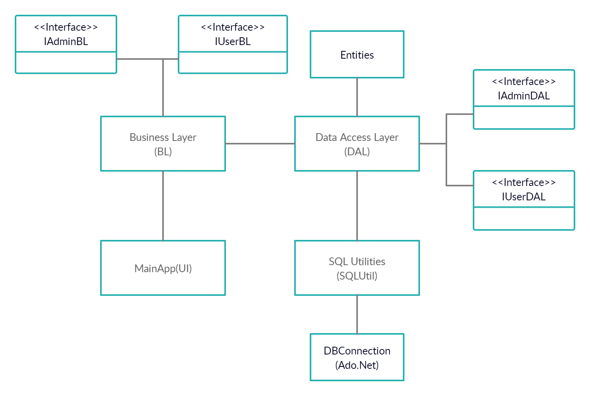
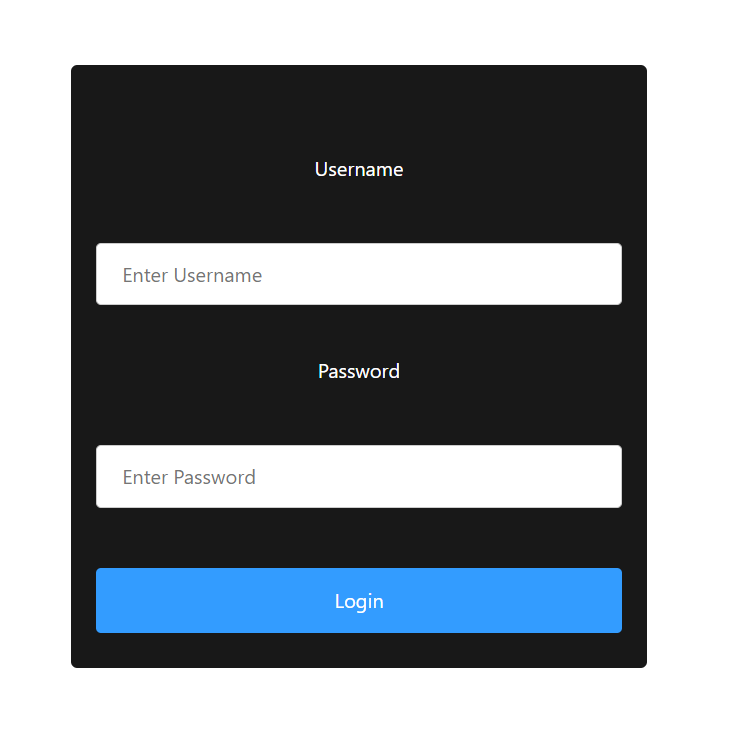
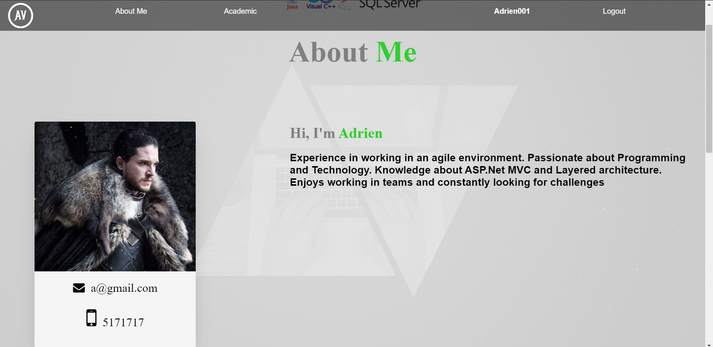
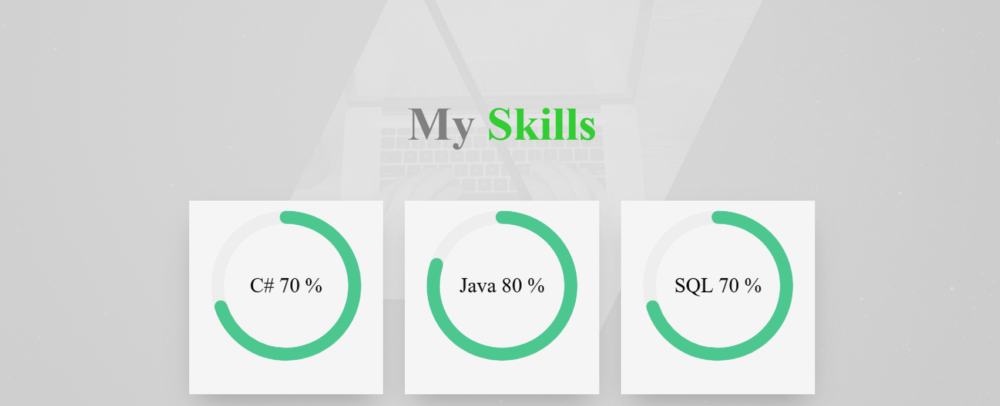

# CVApp - Online Resume Template (Web Application)
###### Work in progress
The aim of this project is to provide an online resume template which users can use to display information like
their own skills,personal statements, education details

# Objective
The objectives of this project are:

User View
- Display user details such as personal statement, skills, education
- Users can add/update skill section

Admin View
- An admin can create a user with username and password
- An admin can view a list of all users
- An admin can view the CV template of other users

# Technologies
 - ASP.Net Core MVC
 - C#
 - SQL Server, ADO.Net
 - JavaScript
 - HTML/CSS

# Architecture

# Sample Screenshots
<table width="500" border="0" cellpadding="5">
<tr>
    <th>Login Screen</th>
    <th>Home Page</th>
  </tr>
  <tr>
    <td align="center" valign="center"></td>
    <td align="center" valign="center"></td>
  </tr>
   <tr>
   <th>About Me Section</th>
    <th>Skills Section</th>
  </tr>
  <tr>
    <td align="center" valign="center"></td>
    <td align="center" valign="center"></td>
  </tr>
</table>
